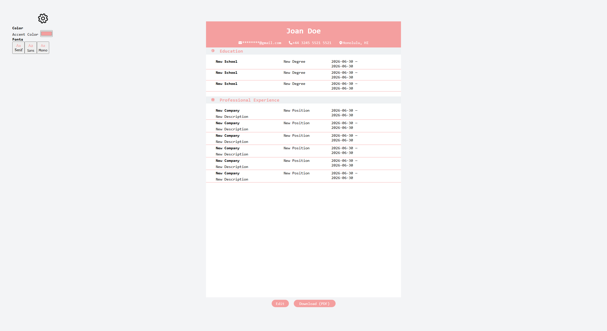
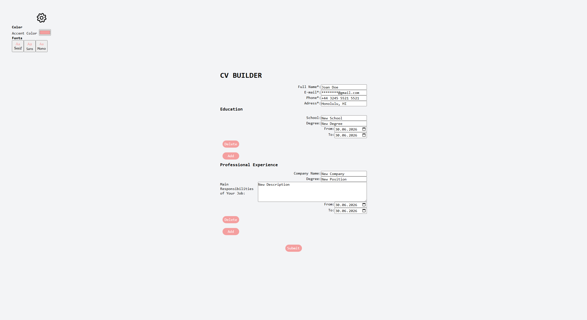

# CV Application

A CV/résumé-application builder. You can choose accent color and font. To download PDF, please use desktop version.

## Technologies

<ul>
  <li><code>JavaScript</code></li>
  <li><code>React</code></li>

</ul>

## Features

- Customizing your résumé's color pallete and font;
- Downloading it as a PDF

## Live Preview

## How to improve?

- on mobile devices: trouble downloading correct view of the pdf.

## Running the project

- Clone the repository <code>git clone https://github.com/Anna-Gladush/React-CV-Application.git</code>

- Install the packages using the command <code>npm install</code>

- Run <code>npm run dev</code>

## Resources

- https://heroicons.com/solid: SVGs
